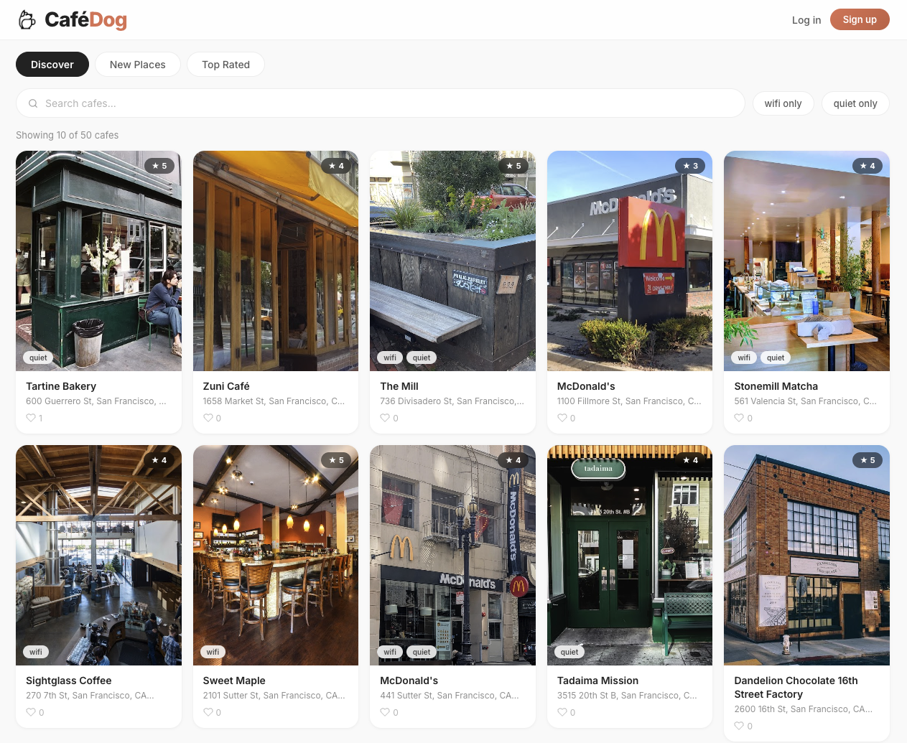

# CaféDog - Coffee Discovery & Check-in Platform

## Author

**Jingjing Pan**  
Email: pan.jingj@northeastern.edu

**Yingyi Kong**  
Email: kong.yin@northeastern.edu

## Class Link

[CS5610 Web Development - Northeastern University](https://johnguerra.co/classes/webDevelopment_online_spring_2026/)

## Project Objective

**CaféDog** is a coffee shop discovery and check‑in platform. Users can browse cafés, filter for work-friendly spots (e.g., **good WiFi** / **quiet**), publish **photo-based posts** (reviews) with ratings, and interact via **likes** and **comments**.

### Key Features

- **Café Discovery**: Search by name, filter (WiFi / quiet), and browse by tabs (Discover / New places / Top rated) with pagination.
- **Café Detail Page**: View café info plus aggregated engagement (likes/saves) and a posts feed.
- **Posts (Reviews)**: Create, edit, and delete posts linked to a café with rating and optional photo.
- **Social Interactions**: Like/unlike posts, full comment CRUD, like/save cafés.
- **Auth & Profiles**: Session-based login/registration; profile pages show posts and cafés (with private tabs for liked/saved content when viewing your own profile).

## Documentation

- **[Design Document](design-document.md)** – Project description, user personas, user stories, and design mockups
- **[API Contract](API_Contract.md)** – API request/response examples

## Live Demo

- **[CaféDog App](https://cafedog.onrender.com/)** – Try CaféDog online (may take 30–60s to wake if idle)
- **[Video Introduction]()** – Watch on YouTube
- **[Presentation Slides](https://docs.google.com/presentation/d/1w4XbNmxJuYF50cAYwc1aHL0473fEScwAsBk3-wYQbNo/edit?slide=id.p18#slide=id.p18)** – Project overview

## Screenshot



## Instructions to Build

### Prerequisites

- **Node.js** v18 or higher ([nodejs.org](https://nodejs.org))
- **MongoDB** – local installation or [MongoDB Atlas](https://www.mongodb.com/atlas) account
- **Cloudinary** (optional but recommended) – required if you want to upload images via the UI
- **Google Places API key** (optional) – only needed if you use Google Places photo references via `/api/places/photo`

### Step 1: Clone and Install

```bash
# In the project root
npm install

# Install frontend deps
cd frontend
npm install
```

### Step 2: Configure Environment

Create a `.env` file in the project root:

```env
# Required
MONGODB_URI="your_mongodb_connection_string"
SESSION_SECRET="a_long_random_secret"

# Optional (image upload)
CLOUDINARY_CLOUD_NAME="..."
CLOUDINARY_API_KEY="..."
CLOUDINARY_API_SECRET="..."

# Optional (Google Places photo proxy)
Maps_API_KEY="..."

# Optional (server port)
PORT=5001
```

### Step 3: Start MongoDB

- **Local**: ensure MongoDB is running (`mongod` or your system service).
- **Atlas**: ensure your cluster is running and your `MONGODB_URI` is correct.

### Step 4: Run the Application (Development)

Start backend (root):

```bash
npm start
```

Start frontend (Vite dev server):

```bash
cd frontend
npm run dev
```

Open your browser:

- Frontend dev server: `http://localhost:5173`
- API is proxied to the backend via Vite, so requests to `/api/*` work during development.

### Step 5: Build & Run (Same-origin Production)

Build the frontend:

```bash
npm run build
```

Run the server (serves `frontend/dist`):

```bash
npm start
```

Open: `http://localhost:5001`

## Seed Synthetic Data

Seed up to ~1000 posts (and create cafés/users if missing):

```bash
npm run seed
```

Drop and recreate seed collections:

```bash
npm run seed -- --drop
```

Generate additional posts per café:

```bash
npm run seed:cafe-posts
```

## How to Use

### Home (Discover)

- **Browse cafés**: scroll the list and click a café card to open details.
- **Search / filter**: search by name, toggle **WiFi** / **Quiet**, switch tabs (Discover / New places / Top rated).
- **Add a café**: click **+ Add** and submit the form (optional cover image upload).

### Café Detail

- **Like / Save café**: toggle like/save on the café detail page (login required).
- **Create a post**: write text, choose a rating, optionally upload a photo, then submit.
- **Edit / delete**: owners can edit/delete their own cafés; authors can edit/delete their own posts.

### Posts (Reviews)

- **Like a post**: click Like to like/unlike (login required).
- **Comments**: add comments; edit/delete your own comments (login required).

### Profile

- View a user’s **posts** and **cafés**.
- When viewing **your own** profile, additional tabs show **liked posts**, **liked cafés**, and **saved cafés**.

## Running Linter / Formatter

```bash
# Format all files (Prettier, repo root)
npm run format

# Check formatting
npm run format:check

# Frontend lint (ESLint)
cd frontend
npm run lint
```

## Technology Stack

- **Backend**: Node.js + Express.js
- **Database**: MongoDB (native driver, no Mongoose)
- **Auth**: `express-session` + `connect-mongo` + Passport Local
- **Frontend**: React (hooks) + React Router + Vite
- **Uploads**: Multer → Cloudinary

## Project Structure

```text
CafeDog/
├── server.js                  # Express server entry (API + static frontend in prod)
├── src/
│   ├── db.js                   # MongoDB client + getDb()
│   ├── auth/
│   │   └── passport.js          # Passport Local strategy + session (de)serialization
│   ├── middleware/
│   │   └── requireAuth.js       # Auth guard for protected routes
│   └── routes/
│       ├── auth.js              # /api/auth/* and /api/me, /api/users/:id
│       ├── cafes.js             # /api/cafes + cafe likes/saves
│       ├── posts.js             # /api/posts + /api/cafes/:id/posts
│       ├── social.js            # post likes + comment CRUD
│       ├── uploads.js           # Cloudinary image upload
│       └── places.js            # Google Places photo proxy
├── frontend/                   # React + Vite app
├── scripts/                    # Seed scripts
├── docs/
│   └── CafeDog.png              # README screenshot
├── API_Contract.md
├── design-document.md
└── README.md
```

## API Endpoints (Summary)

### Auth / Profile

- `POST /api/auth/register`
- `POST /api/auth/login`
- `POST /api/auth/logout`
- `GET /api/me`
- `PATCH /api/me`
- `GET /api/users/:id`

### Cafés

- `GET /api/cafes` (search/filter/paginate, supports `sort=new|top`)
- `GET /api/cafes/:id`
- `POST /api/cafes`
- `PUT /api/cafes/:id` (owner only)
- `DELETE /api/cafes/:id` (owner only, cascades related data)
- `GET /api/cafes/:id/likes`
- `POST /api/cafes/:id/likes` (login required)
- `DELETE /api/cafes/:id/likes` (login required)
- `GET /api/cafes/:id/saved` (login required)
- `POST /api/cafes/:id/saved` (login required)
- `DELETE /api/cafes/:id/saved` (login required)

### Posts (Reviews) + Social

- `POST /api/posts`
- `GET /api/cafes/:id/posts`
- `GET /api/posts?cafeId=...`
- `PUT /api/posts/:postId` (author only)
- `DELETE /api/posts/:postId` (author only)
- `GET /api/posts/:postId/likes`
- `POST /api/posts/:postId/likes` (login required)
- `DELETE /api/posts/:postId/likes` (login required)
- `GET /api/posts/:postId/comments`
- `POST /api/posts/:postId/comments` (login required)
- `PATCH /api/comments/:commentId` (comment owner only)
- `DELETE /api/comments/:commentId` (comment owner only)

### Uploads / Places

- `POST /api/uploads/image` (multipart form-data `file`)
- `GET /api/places/photo?ref=...`

## MongoDB Collections

1. **users**
   - `email`, `username`, `passwordHash`, `createdAt`
2. **cafes**
   - `name`, `address`, `has_good_wifi`, `is_quiet`, `rating`, `cover_image`, `createdBy?`, `googlePlaceId?`, `location?`
3. **posts**
   - `cafeId`, `authorId?`, `author`, `text`, `photoUrl`, `rating`, `createdAt`, `updatedAt?`
4. **likes**
   - `postId`, `userId`, `createdAt`
5. **comments**
   - `postId`, `userId`, `text`, `createdAt`, `updatedAt`
6. **cafeLikes**
   - `cafeId`, `userId`, `createdAt`
7. **cafeSaves**
   - `cafeId`, `userId`, `createdAt`
8. **sessions**
   - Session documents stored by `connect-mongo`

## Features Implemented

✅ Node.js + Express.js backend  
✅ MongoDB with native driver (no Mongoose)  
✅ React + Vite frontend with client-side routing  
✅ Session-based auth (Passport Local + `express-session`)  
✅ CRUD for cafés and posts; full CRUD for comments  
✅ Likes for posts + like/save for cafés  
✅ Image upload (Cloudinary) + Google Places photo proxy  
✅ Prettier formatting scripts  
✅ No exposed credentials (uses environment variables)  
✅ No prohibited libraries used (no `axios`, `mongoose`, or `cors` package)

## License

This project is licensed under the MIT License - see the `LICENSE` file for details.
